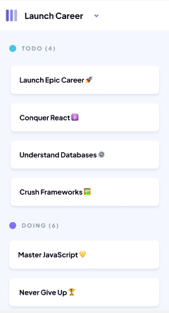

# Kanban Board UI Implementation

## 🔗 Figma Design Link

Refer to the Figma design before starting this project to align layout, styling, and responsiveness:
[View Figma Design](https://www.figma.com/design/y7bFCUYL5ZHfPeojACBXg2/Challenge-1-%7C-JSL?node-id=0-1&t=yngAIXXKnJfH7Jj3-1)

---

## 📋 Overview

This project focuses on building a **responsive and visually accurate Kanban board UI** based on a provided Figma design. The layout includes a static sidebar, multiple task columns, and task cards that follow the specified visual guidelines.

---

## ✅ Before You Begin

Make sure to review the **project user stories** on your student dashboard before coding.

---

## 🎯 Key Objectives

- Add a **favicon and descriptive page title**.
- Build a **Kanban board UI** with multiple columns (e.g., **To Do, Doing, Done**).
- Match the **layout, typography, spacing, and color scheme** to the Figma design.
- Ensure **responsiveness** across both **mobile and desktop** devices.
- Create **task cards** with titles, shadows, and padding based on the design.
- Implement a **static sidebar** that includes branding, icons, and a button.

---

## 🧩 Features

- 📌 Static sidebar with branding and a "Launch Career" button
- 🗂️ Three Kanban columns: **TODO, DOING, DONE**
- 🎯 Task cards with meaningful titles and visual consistency
- 🌐 Fully responsive layout for **mobile** and **desktop**
- 🎨 Clean CSS structure using `--sb-width` for dynamic sidebar sizing

---

## 📱 Mobile View

---

## 💻 Desktop View

---

## 🚀 Expected Outcome

A polished and **responsive Kanban board** that:

- Closely follows the Figma specs
- Offers a clean and professional user experience
- Demonstrates understanding of HTML & CSS structure
- Is visually consistent across all screen sizes

---

## 🛠️ Technologies Used

- HTML5
- CSS3 (Flexbox, Responsive Design)
- Custom Variables (CSS)
- Google Fonts (Libertinus Mono)
